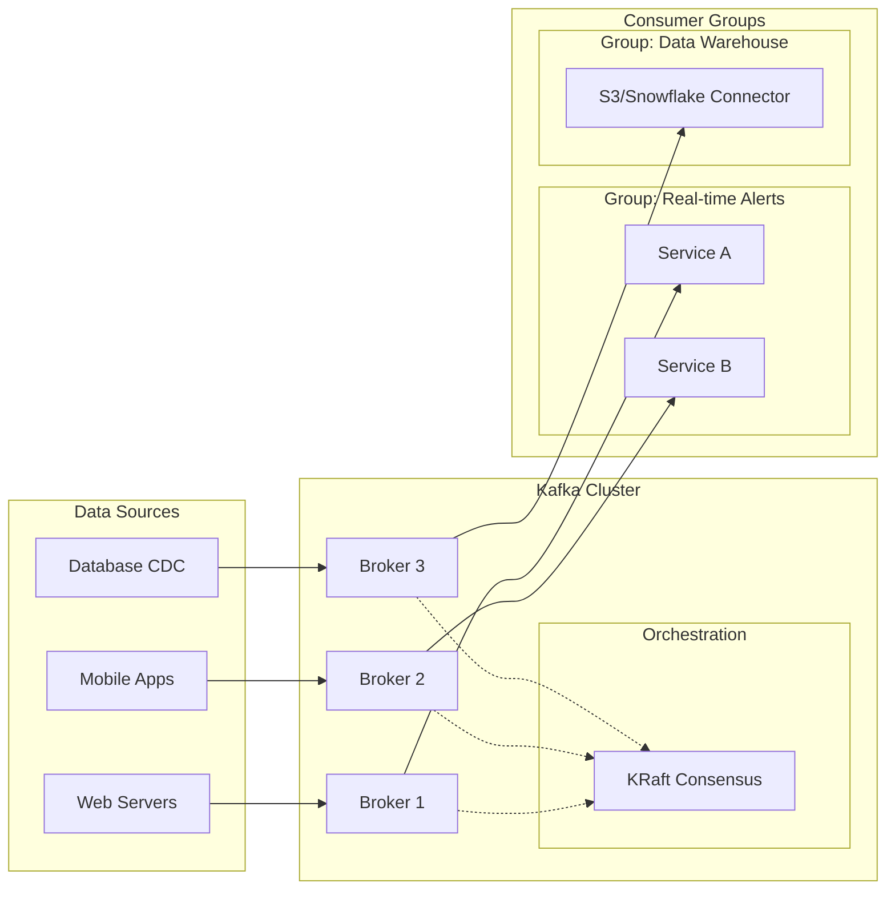
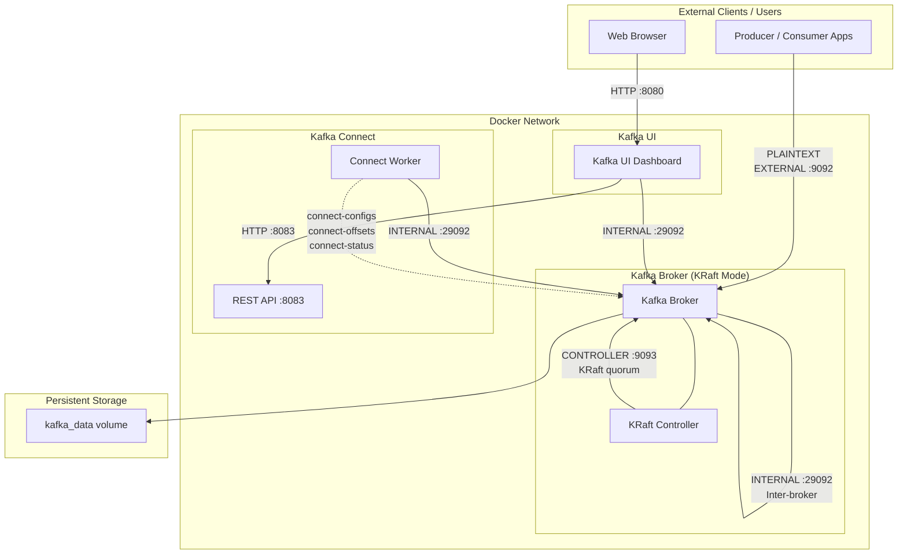

# Message Broker - Apache Kafka

## Run Service using Docker
```Bash
docker compose down -v
docker compose up -d
```

## The Core Data Architecture
Kafka operates on a Pub/Sub (Publish/Subscribe) model combined with a distributed commit log.

### Producers
- The Originators: Producers are client applications that push events into Kafka topics.
- Load Balancing: They use a "partitioner" logic. If a message has a key (e.g., `order_id`), Kafka hashes that key to ensure all messages for that specific ID always go to the same partition.
- Acknowledgements (acks): Producers can choose their level of safety. They can wait for the Broker to confirm it received the message (`acks=all`) or send it and forget (`acks=0`) for maximum speed.

### Consumers & Consumer Groups
- Pull Model: Unlike traditional systems that "push" data to users, Kafka consumers "pull" data when they are ready. This prevents the consumer from being overwhelmed.
- The Group Concept: A Consumer Group allows you to scale processing. If a Topic has 4 partitions and a group has 4 consumers, each consumer takes 1 partition. If one consumer fails, the remaining 3 will automatically rebalance and take over the work.

### Brokers
- The Backbone: A Kafka cluster is composed of multiple Brokers (servers).
- Statelessness & Storage: Brokers are designed to be "dumb" so they can be fast. They don't track which consumer has read what; they simply store the data as a sequential log on disk.
- Replication Factor: Brokers replicate data. If a Topic has a replication factor of 3, your data exists on three different Brokers. If one Broker crashes, the data remains available.

### Zookeeper vs. KRaft
- *Zookeeper*: Historically, Kafka was the "body" and Zookeeper was the "brain." It managed the heartbeats of brokers and elected leaders for partitions.
- *KRaft (Kafka Raft)*: This is the modern replacement. It allows Kafka to manage its own metadata. This makes the cluster easier to manage, more scalable, and significantly faster to recover after a shutdown.



## How Data is Organized
To keep things orderly, Kafka uses three main structural concepts:

### Topics: The Logical Stream
- Think of a Topic as a "folder" in a file system or a "table" in a database.
- Purpose: It organizes messages by type (e.g., `user-signups`, `payment-logs`, `gps-coordinates`).
- Stream vs. Table: Unlike a database table where you update a row, a Kafka Topic only appends new data to the end. You don't change the past; you only add the present.

### Partitions: The Unit of Scalability
A Topic is just a logical name; the Partition is where the actual data lives. One Topic can have 1, 10, or 1,000 partitions.

#### Ordering Guarantee
- Inside a single partition, data is strictly ordered by time of arrival: If Message A comes before Message B in Partition 0, it will stay that way forever.
- Note: Kafka does not guarantee order across different partitions. If you need strict global order, you use one partition (which limits speed).

#### Parallelism
This is why Kafka is fast. If you have 10 partitions, you can have 10 different Consumers reading from them simultaneously. Each partition can live on a different Broker (server), spreading the CPU and I/O load across your entire cluster.

#### Replication
- Partitions are the things that get copied.
- Leader: Every partition has one Broker acting as the "Leader." All reads and writes go through it.
- Follower: Other Brokers act as "Followers," silently syncing data from the Leader. *If the Leader dies, a Follower is instantly promoted*.

### Offsets: The Consumer's Bookmark
- Since Kafka does not delete messages after they are read, it needs a way to know where each Consumer left off. That "bookmark" is the Offset.
- Sequential ID: Offsets are integers that start at 0 and increase by 1 for every message in a partition.
- Immutable: You cannot change an offset of a message.
- Consumer Managed: The Consumer (or the Kafka cluster on behalf of the consumer) stores the last successful offset it processed.
- Example: If a consumer crashes at Offset 500, when it restarts, it asks Kafka: "Give me everything starting from Offset 501."

## Guarantees and Durability
- Replication: Kafka copies your partitions across multiple brokers. If one server goes down, another takes over without losing data.
- Persistence: It writes data to disk immediately. Unlike traditional message queues that hold data in RAM, Kafka is built to be a durable storage system.
- Decoupling: Producers don't need to know who the consumers are. You can add a new consumer (like a data warehouse) weeks after the data was produced, and it can "replay" the history from the beginning.

## The Core Deploy Architecture



### Components

#### Kafka Broker (KRaft mode)

1. **The Role of the Controller Quorum**
In KRaft, brokers are assigned specific roles via the `process.roles` configuration. A node can be a `broker`, a `controller`, or both (combined mode).

    - *Active Controller*: One node in the quorum is elected as the leader. It manages the Metadata Log.
    - *Voters*: The other controllers in the quorum follow the leader, replicating the metadata log to ensure high availability.
    - *Observers*: Standard brokers that aren't part of the quorum but consume the metadata log to stay updated on cluster state.

2. **Key Configuration Parameters**
To enable KRaft, you must move away from the `zookeeper.connect` property. The following settings are mandatory in your `server.properties`:

| Property | Description | 
| --- | --- |
| `process.roles` | Set to broker, controller, or broker,controller. |
| `node.id` | A unique integer ID for the node in the cluster. |
| `controller.quorum.voters` | A list of all controller nodes (e.g., `1@localhost:9093`,`2@localhost:9093`). |
| `listeners` | Must include a listener for the controller (e.g., `CONTROLLER://:9093`). | 
| `controller.listener.names` | Tells the broker which listener is dedicated to the KRaft quorum. |

3. **The Cluster ID & Formatting**
Unlike ZooKeeper, where Kafka just "shows up" and registers, KRaft requires an explicit cluster initialization step. You must generate a Cluster ID and format the storage directories before starting the brokers:
- Generate ID: `kafka-storage.sh random-uuid`
- Format Log: `kafka-storage.sh format -t <UUID> -c /path/to/server.properties`

### Port Inventory

#### Kafka Broker (apache/kafka)

| Port (default) | Listener Name | Purpose | Connectors |
| --- | --- | --- | --- |
| 9092 | EXTERNAL | Client access from outside Docker | Producers / Consumers on host machine or external servers | 
| 29092 | INTERNAL | Internal Docker network communication | Kafka Connect, Kafka UI, other Docker services |
| 9093 | CONTROLLER | KRaft metadata quorum & controller communication | Kafka Broker itself (controller <-> broker) | 