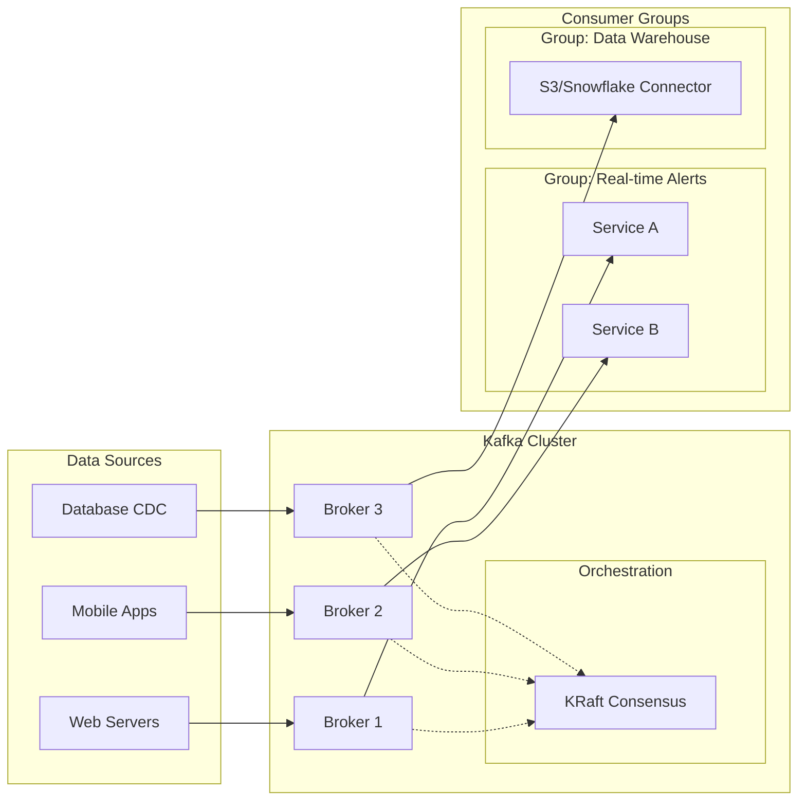

# Message Broker - Apache Kafka

## Run Service using Docker
```Bash
docker compose down -v
docker compose up -d
```

## The Core Architecture
Kafka operates on a Pub/Sub (Publish/Subscribe) model combined with a distributed commit log.

### Producers
- The Originators: Producers are client applications that push events into Kafka topics.
- Load Balancing: They use a "partitioner" logic. If a message has a key (e.g., `order_id`), Kafka hashes that key to ensure all messages for that specific ID always go to the same partition.
- Acknowledgements (acks): Producers can choose their level of safety. They can wait for the Broker to confirm it received the message (`acks=all`) or send it and forget (`acks=0`) for maximum speed.

### Consumers & Consumer Groups
- Pull Model: Unlike traditional systems that "push" data to users, Kafka consumers "pull" data when they are ready. This prevents the consumer from being overwhelmed.
- The Group Concept: A Consumer Group allows you to scale processing. If a Topic has 4 partitions and a group has 4 consumers, each consumer takes 1 partition. If one consumer fails, the remaining 3 will automatically rebalance and take over the work.

### Brokers
- The Backbone: A Kafka cluster is composed of multiple Brokers (servers).
- Statelessness & Storage: Brokers are designed to be "dumb" so they can be fast. They don't track which consumer has read what; they simply store the data as a sequential log on disk.
- Replication Factor: Brokers replicate data. If a Topic has a replication factor of 3, your data exists on three different Brokers. If one Broker crashes, the data remains available.

### Zookeeper vs. KRaft
- *Zookeeper*: Historically, Kafka was the "body" and Zookeeper was the "brain." It managed the heartbeats of brokers and elected leaders for partitions.
- *KRaft (Kafka Raft)*: This is the modern replacement. It allows Kafka to manage its own metadata. This makes the cluster easier to manage, more scalable, and significantly faster to recover after a shutdown.



## How Data is Organized
To keep things orderly, Kafka uses three main structural concepts:

- Topics: A Topic is a specific category or feed name to which records are published. Think of it like a table in a database, but instead of static rows, it’s a continuous stream of events.
- Partitions: Topics are split into Partitions. This is the secret to Kafka’s massive scalability. 
    - Data in a partition is strictly ordered.
    - Partitions allow a topic to be spread across multiple brokers, allowing multiple consumers to read the topic in parallel.
- Offsets: Each message within a partition is assigned a unique sequential ID called an Offset. Kafka doesn't delete a message once it's read; it stays there until a pre-defined retention period expires. Consumers simply keep track of their "current offset" to know where they left off.

## Guarantees and Durability
- Replication: Kafka copies your partitions across multiple brokers. If one server goes down, another takes over without losing data.
- Persistence: It writes data to disk immediately. Unlike traditional message queues that hold data in RAM, Kafka is built to be a durable storage system.
- Decoupling: Producers don't need to know who the consumers are. You can add a new consumer (like a data warehouse) weeks after the data was produced, and it can "replay" the history from the beginning.