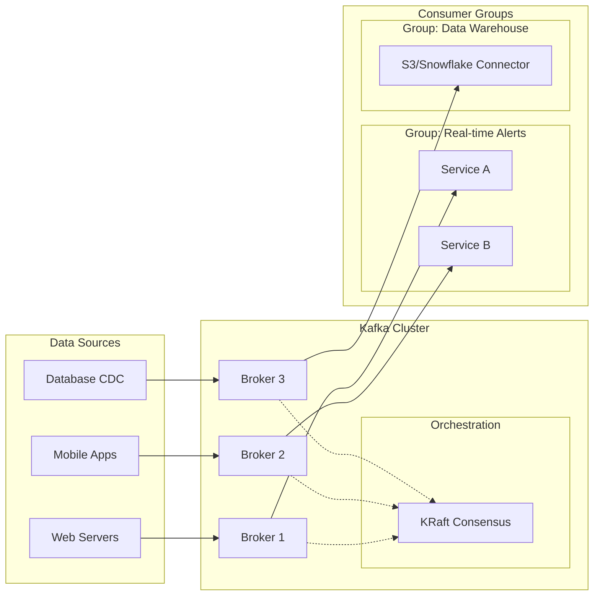
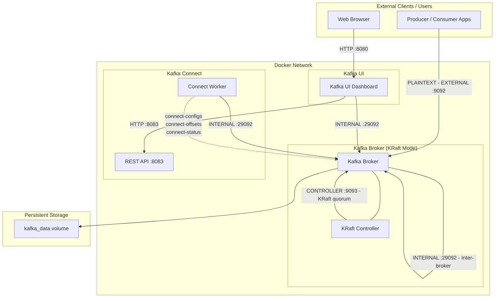

# Message Broker - Apache Kafka

## Run Service using Docker
```Bash
docker compose down -v
docker compose up -d
```

## The Core Data Architecture
Kafka operates on a Pub/Sub (Publish/Subscribe) model combined with a distributed commit log.

### Producers
- The Originators: Producers are client applications that push events into Kafka topics.
- Load Balancing: They use a "partitioner" logic. If a message has a key (e.g., `order_id`), Kafka hashes that key to ensure all messages for that specific ID always go to the same partition.
- Acknowledgements (acks): Producers can choose their level of safety. They can wait for the Broker to confirm it received the message (`acks=all`) or send it and forget (`acks=0`) for maximum speed.

### Consumers & Consumer Groups
- Pull Model: Unlike traditional systems that "push" data to users, Kafka consumers "pull" data when they are ready. This prevents the consumer from being overwhelmed.
- The Group Concept: A Consumer Group allows you to scale processing. If a Topic has 4 partitions and a group has 4 consumers, each consumer takes 1 partition. If one consumer fails, the remaining 3 will automatically rebalance and take over the work.

### Brokers
- The Backbone: A Kafka cluster is composed of multiple Brokers (servers).
- Statelessness & Storage: Brokers are designed to be "dumb" so they can be fast. They don't track which consumer has read what; they simply store the data as a sequential log on disk.
- Replication Factor: Brokers replicate data. If a Topic has a replication factor of 3, your data exists on three different Brokers. If one Broker crashes, the data remains available.

### Zookeeper vs. KRaft
- *Zookeeper*: Historically, Kafka was the "body" and Zookeeper was the "brain." It managed the heartbeats of brokers and elected leaders for partitions.
- *KRaft (Kafka Raft)*: This is the modern replacement. It allows Kafka to manage its own metadata. This makes the cluster easier to manage, more scalable, and significantly faster to recover after a shutdown.



## How Data is Organized
To keep things orderly, Kafka uses three main structural concepts:

### Topics: The Logical Stream
- Think of a Topic as a "folder" in a file system or a "table" in a database.
- Purpose: It organizes messages by type (e.g., `user-signups`, `payment-logs`, `gps-coordinates`).
- Stream vs. Table: Unlike a database table where you update a row, a Kafka Topic only appends new data to the end. You don't change the past; you only add the present.

### Partitions: The Unit of Scalability
A Topic is just a logical name; the Partition is where the actual data lives. One Topic can have 1, 10, or 1,000 partitions.

#### Ordering Guarantee
- Inside a single partition, data is strictly ordered by time of arrival: If Message A comes before Message B in Partition 0, it will stay that way forever.
- Note: Kafka does not guarantee order across different partitions. If you need strict global order, you use one partition (which limits speed).

#### Parallelism
This is why Kafka is fast. If you have 10 partitions, you can have 10 different Consumers reading from them simultaneously. Each partition can live on a different Broker (server), spreading the CPU and I/O load across your entire cluster.

#### Replication
- Partitions are the things that get copied.
- Leader: Every partition has one Broker acting as the "Leader." All reads and writes go through it.
- Follower: Other Brokers act as "Followers," silently syncing data from the Leader. *If the Leader dies, a Follower is instantly promoted*.

### Offsets: The Consumer's Bookmark
- Since Kafka does not delete messages after they are read, it needs a way to know where each Consumer left off. That "bookmark" is the Offset.
- Sequential ID: Offsets are integers that start at 0 and increase by 1 for every message in a partition.
- Immutable: You cannot change an offset of a message.
- Consumer Managed: The Consumer (or the Kafka cluster on behalf of the consumer) stores the last successful offset it processed.
- Example: If a consumer crashes at Offset 500, when it restarts, it asks Kafka: "Give me everything starting from Offset 501."

## Guarantees and Durability
- Replication: Kafka copies your partitions across multiple brokers. If one server goes down, another takes over without losing data.
- Persistence: It writes data to disk immediately. Unlike traditional message queues that hold data in RAM, Kafka is built to be a durable storage system.
- Decoupling: Producers don't need to know who the consumers are. You can add a new consumer (like a data warehouse) weeks after the data was produced, and it can "replay" the history from the beginning.

## The Core Deploy Architecture



### Components

#### Kafka Broker (KRaft mode)

1. **The Role of the Controller Quorum**: 
In KRaft, brokers are assigned specific roles via the `process.roles` configuration. A node can be a `broker`, a `controller`, or both (combined mode).

    - *Active Controller*: One node in the quorum is elected as the leader. It manages the Metadata Log.
    - *Voters*: The other controllers in the quorum follow the leader, replicating the metadata log to ensure high availability.
    - *Observers*: Standard brokers that aren't part of the quorum but consume the metadata log to stay updated on cluster state.

2. **Key Configuration Parameters**: 
To enable KRaft, you must move away from the `zookeeper.connect` property. The following settings are mandatory in your `server.properties`:

| Property | Description | 
| --- | --- |
| `process.roles` | Set to broker, controller, or broker,controller. |
| `node.id` | A unique integer ID for the node in the cluster. |
| `controller.quorum.voters` | A list of all controller nodes (e.g., `1@localhost:9093`,`2@localhost:9093`). |
| `listeners` | Must include a listener for the controller (e.g., `CONTROLLER://:9093`). | 
| `controller.listener.names` | Tells the broker which listener is dedicated to the KRaft quorum. |

3. **The Cluster ID & Formatting**
Unlike ZooKeeper, where Kafka just "shows up" and registers, KRaft requires an explicit cluster initialization step. You must generate a Cluster ID and format the storage directories before starting the brokers:
- Generate ID: `kafka-storage.sh random-uuid`
- Format Log: `kafka-storage.sh format -t <UUID> -c /path/to/server.properties`

#### Kafka Connect & Kafka Connectors

1. **Kafka Connect (The Framework)**: 
Kafka Connect is the runtime environment. It is a JVM (Java Virtual Machine) process that runs separately from your Kafka Brokers.
    - *Responsibility*: It handles the parts of data integration: reliability, scaling, fault tolerance, and offset management (remembering where it left off).
    - *Modes*: It can run in Standalone (one process) or Distributed (a cluster of workers) mode.
    - *The "Engine"*: It provides the REST API (usually on port `8083`) that allows you to manage and monitor data flows.
    - *Configuration*:

| Parameter (Environment Variable) | Purpose & FunctionConnectivity | 
| --- | --- | 
| `CONNECT_BOOTSTRAP_SERVERS` | The list of Kafka Brokers used to establish the initial connection and discover the full cluster. |
| `CONNECT_GROUP_ID` | A unique name for the Connect cluster. Workers with the same ID work together to share the load.| 
| `CONNECT_REST_PORT` | The port for the REST interface (default: 8083) used to manage connectors via commands. | 
| `CONNECT_REST_LISTENERS` | Defines the protocol and IP address the API listens on (e.g., http://0.0.0.0:8083). |
| `CONNECT_REST_ADVERTISED_HOST_NAME` | The hostname that other workers in the cluster use to communicate with this specific worker. | 
| `CONNECT_CONFIG_STORAGE_TOPIC` | Kafka topic where connector configurations (like DB credentials) are stored. | 
| `CONNECT_OFFSET_STORAGE_TOPIC` | Kafka topic that stores how much data has been processed (pointers/offsets). |
| `CONNECT_STATUS_STORAGE_TOPIC` | Kafka topic that tracks the health and state (Running/Failed) of connectors. | 
| `CONNECT_..._REPLICATION_FACTOR` | Defines how many copies of internal topics are kept. 1 is for dev; 3 is for production | 
| `CONNECT_KEY_CONVERTER` | The class used to serialize/deserialize the message Key (e.g., String, JSON, Avro) | 
| `CONNECT_VALUE_CONVERTER` | The class used to serialize/deserialize the message Payload (Value) | 
| `CONNECT_VALUE_CONVERTER_SCHEMAS_ENABLE` | If true, includes the data structure definition inside every message. | 
| `CONNECT_PLUGIN_PATH` | The directory where Kafka Connect looks for connector .jar files (the "drivers"). |

3. **Essential Kafka Connect REST API Reference**:

| Action | Endpoint | Purpose |
| --- | --- | --- |
| List Plugins | `GET/connector-plugins` | Check available connectors (MySQL, S3, etc.). | 
| List Connectors | `GET/connectors` | See all active connector names. | 
| Create/Update | `PUT/connectors/{name}/config` | Create a new connector or update settings | 
| Check Status | `GET/connectors/{name}/status` | Crucial: See if it is RUNNING or FAILED. | 
| Get Config | `GET/connectors/{name}` | View the current configuration of a connector. |
| Restart | `POST/connectors/{name}/restart` | Fix a connector that has crashed/failed. | 
| Pause/Resume | `PUT/connectors/{name}/pause` | Temporarily stop data flow. | 
| Delete | `DELETE/connectors/{name}` | Completely remove a connector. |

4. **Example configuration for the popular Confluent HTTP Sink Connector**: The Configuration (JSON)You would send this JSON to the `POST /connectors` endpoint

```JSON
{
  "name": "http-sink-test",
  "config": {
    "connector.class": "io.confluent.connect.http.HttpSinkConnector",
    "http.api.url": "http://notification-service-api-1:3000/v1/events/trigger",
    "headers": "Content-Type:application/json|Authorization:ApiKey 3eedcd3be2c04f075729bedd949c549c",
    "topics": "email_verification",
    "tasks.max": "1",
    "batch.max.size": "1",
    "batch.json.as.array": "false",
    "concurrency.limit": "5",
    "request.method": "POST",
    "request.body.format": "json",
    "value.converter": "org.apache.kafka.connect.json.JsonConverter",
    "value.converter.schemas.enable": "false",
    "key.converter": "org.apache.kafka.connect.storage.StringConverter",
    "confluent.topic.bootstrap.servers": "kafka:29092",
    "reporter.bootstrap.servers": "kafka:29092",
    "reporter.error.topic.name": "http-error-topic",
    "reporter.result.topic.name": "http-success-topic",
    "reporter.error.topic.replication.factor": "1",
    "reporter.result.topic.replication.factor": "1",
    "errors.tolerance": "all",
    "errors.log.enable": "true",
    "errors.log.include.messages": "true",
    "confluent.license": ""
  }
}
```

    - Core configuration:
    
| Parameter | Purpose | 
| --- | --- |
| `name` | The unique identifier for this connector instance |
| `connector.class` | Defines the *engine* used. `HttpSinkConnector` tells Kafka to send data from a topic to an external HTTP endpoint. |
| `topics` | The Kafka topic that the connector "listens" to | 
| `tasks.max` | The maximum number of worker threads. For Sink connectors, this should generally not exceed the number of partitions in your topic | 

    - HTTP & Connection Settings:

| Parameter | Purpose | 
| --- | --- |
| `http.api.url` | The destination URL where the data will be sent. |
| `request.method` | Usually POST for sending new data. | 
| `headers` | Used for authentication or content-type settings. | 
| `concurrency.limit` | The maximum number of concurrent HTTP requests each task can handle. Setting this to `5` allows the connector to process data faster without waiting for each individual response before starting the next |

    - Data Transformation & Formatting

| Parameter | Purpose | 
| --- | --- |
| `value.converter` | Converts the raw bytes from Kafka into a structured format. `JsonConverter` is used to output JSON | 
| `value.converter.schemas.enable` | Set to `false` to prevent Kafka from wrapping your data in a complex "schema" and "payload" structure, keeping the JSON clean |
| `request.body.format` | Explicitly tells the connector to format the outgoing HTTP request body as a JSON string |
| `batch.max.size` | The number of Kafka records to bundle into one HTTP request. You set this to 1 for real-time, record-by-record processing |
| `batch.json.as.array` | Set to false to send a single JSON object `{...}` instead of a list `[{...}]` |

    - Error Handling & Reporting (The "Reporter")

| Parameter | Purpose | 
| --- | --- |
| `errors.tolerance` | Set to `all` so that the connector doesn't stop if it hits a "poison pill" (bad record). Instead, it moves to the next message |
| `reporter.result.topic.name` | A "Success Topic" that logs details of every successful HTTP request (status 200) |
| `reporter.error.topic.name` | A "Dead Letter Queue" topic. If the API returns an error (like the 400 or 422 you saw), the full error report is sent here for debugging |
| `errors.log.enable` | Prints error details directly into the Kafka Connect worker logs for immediate visibility |

    - Infrastructure

| Parameter | Purpose | 
| --- | --- |
| `confluent.topic.bootstrap.servers` | The Kafka broker address used for internal metadata and reporting topics |
| `confluent.license` | Used for Confluent enterprise features. Leaving it empty usually defaults to a trial mode for this specific connector |

5. **Kafka Connectors (The Plugins)**:
A Kafka Connector is the specific implementation or "driver" designed to talk to a specific external system. These are typically JAR files that you download and place in the plugin.path of your Kafka Connect worker.
- *Source Connectors*: Ingest data from an external system (e.g., Salesforce, MongoDB, MQTT) into Kafka.
- *Sink Connectors*: Export data from Kafka to an external system (e.g., Snowflake, Amazon S3, Elasticsearch).
- *Responsibility*: The connector only cares about how to talk to the specific database or API it was built for.

6. Important topic

| Topic | Purpose | 
| --- | --- |
| `_confluent-command` | Special *internal system* topic used by the Confluent Platform to manage the lifecycle and state of various component. This topic should be created before creating any connectors using `HttpSinkConnector` |
| `http-error-topic` | A "Dead Letter Queue" topic. If the API returns an error (like the 400 or 422 you saw), the full error report is sent here for debugging. Should be specify while creating connectors |
| `http-success-topic` | A "Success Topic" that logs details of every successful HTTP request (status 200). Should be specify while creating connectors |

### Port Inventory

#### Kafka Broker (apache/kafka)

| Port (default) | Listener Name | Purpose | Connectors |
| --- | --- | --- | --- |
| 9092 | EXTERNAL | Client access from outside Docker | Producers / Consumers on host machine or external servers | 
| 29092 | INTERNAL | Internal Docker network communication | Kafka Connect, Kafka UI, other Docker services |
| 9093 | CONTROLLER | KRaft metadata quorum & controller communication | Kafka Broker itself (controller <-> broker) | 

#### Kafka Connect

| Port (default) | Purpose | Connectors |
| --- | --- | --- |
| 8083 | REST API for managing connectors | Kafka UI, curl, REST clients |